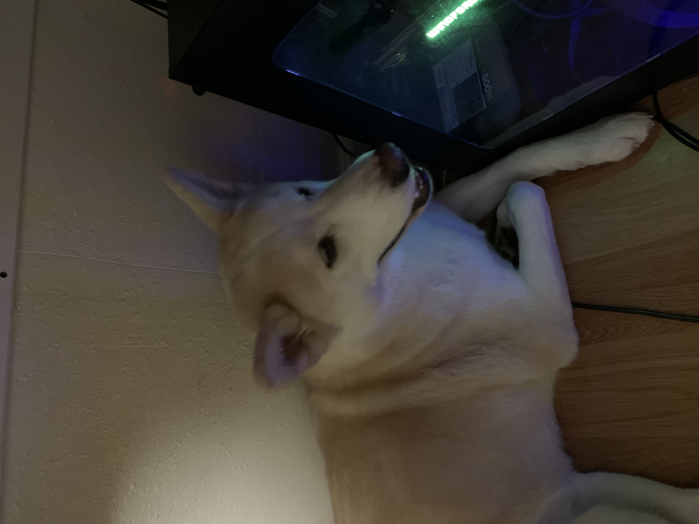

## Avery's Page
Hello, I am Avery Pham. I'm a Math-CS major at [UCSD](https://ucsd.edu/) and I enjoy playing videogames (specifically CSGO), playing with my dog, and swimming. 

**My favorite foods are:**
- Pizza
- Burgers
- Mi Quang (a Vietnamese noodle dish) 
- Tacos

**Things I like and don't like:**
- [ ] Coming up with stuff to write for this lab
- [x] Playing videogames

**My favorite quote:**
> If it ain't broke, don't fix it.

Before college, my only exposure to programming was taking AP Computer Science in high school. Currently I'm pretty interested in C++ and its internals and hope to learn more about all the cool things that C++ is capable of. I also find C to be interesting, though I do not program in C anymore. In particular, I find weird and obfsucated code very fun. For example, this snippet of code written by [Andy Sloane](https://www.a1k0n.net/about.html): 
```
             k;double sin()
         ,cos();main(){float A=
       0,B=0,i,j,z[1760];char b[
     1760];printf("\x1b[2J");for(;;
  ){memset(b,32,1760);memset(z,0,7040)
  ;for(j=0;6.28>j;j+=0.07)for(i=0;6.28
 >i;i+=0.02){float c=sin(i),d=cos(j),e=
 sin(A),f=sin(j),g=cos(A),h=d+2,D=1/(c*
 h*e+f*g+5),l=cos      (i),m=cos(B),n=s\
in(B),t=c*h*g-f*        e;int x=40+30*D*
(l*h*m-t*n),y=            12+15*D*(l*h*n
+t*m),o=x+80*y,          N=8*((f*e-c*d*g
 )*m-c*d*e-f*g-l        *d*n);if(22>y&&
 y>0&&x>0&&80>x&&D>z[o]){z[o]=D;;;b[o]=
 ".,-~:;=!*#$@"[N>0?N:0];}}/*#****!!-*/
  printf("\x1b[H");for(k=0;1761>k;k++)
   putchar(k%80?b[k]:10);A+=0.04;B+=
     0.02;}}/*****####*******!!=;:~
       ~::==!!!**********!!!==::-
         .,~~;;;========;;;:~-.
             ..,--------,*/
```
which produces an animation of a rotating donut when ran.

## Cool section
[a relative link](README.md)